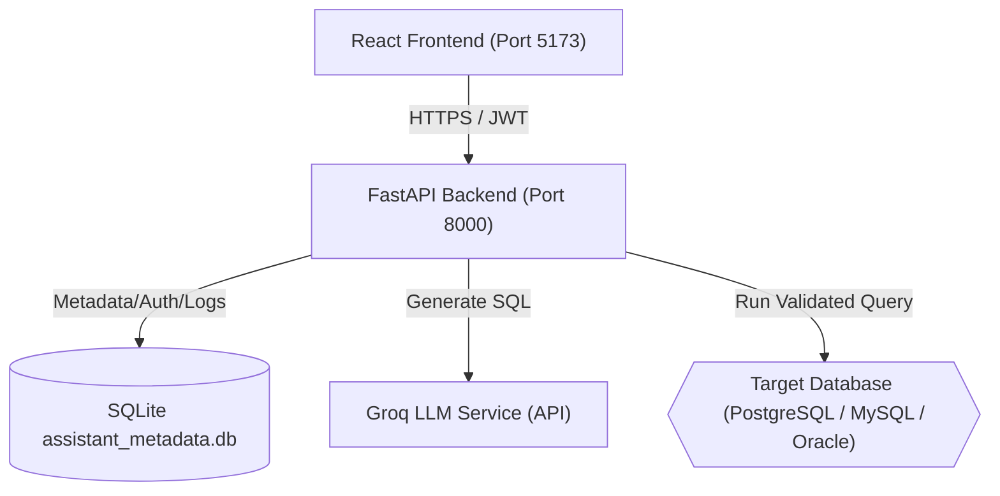
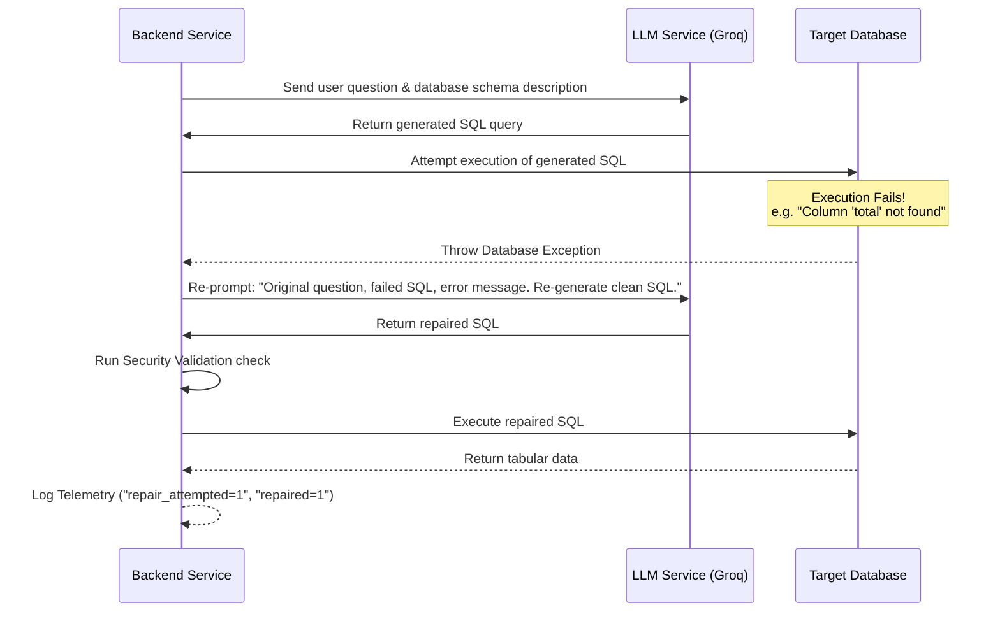

# AI Database Assistant — Complete Reference Documentation

Welcome to the AI Database Assistant documentation. This guide is designed for developers, system administrators, and product managers to understand the entirety of this application—from high-level architecture and features to lower-level implementation details, security configurations, and execution flows.

---

## Table of Contents
1. [Executive Summary](#1-executive-summary)
2. [High-Level Architecture](#2-high-level-architecture)
3. [Core Product Features](#3-core-product-features)
4. [System Architecture & Data Flows](#4-system-architecture--data-flows)
5. [Directory & Code Organization](#5-directory--code-organization)
6. [Database & Metadata Architecture](#6-database--metadata-architecture)
7. [API Reference (FastAPI Backend)](#7-api-reference-fastapi-backend)
8. [Frontend Component Architecture (React Client)](#8-frontend-component-architecture-react-client)
9. [Security Hardening & Policies](#9-security-hardening--policies)
10. [SQL Generation & Automatic Repair Flow](#10-sql-generation--automatic-repair-flow)
11. [Dynamic Portfolio Dashboard](#11-dynamic-portfolio-dashboard)
12. [Local Setup & Docker Deployment Guides](#12-local-setup--docker-deployment-guides)
13. [Verification & Telemetry Systems](#13-verification--telemetry-systems)

---

## 1. Executive Summary

The **AI Database Assistant** is a enterprise-ready business intelligence platform that bridges the gap between natural language questions and relational databases. Instead of requiring users to write SQL code, they can ask questions in plain English (e.g., *"How much rent did we collect last month?"*). The system:
1. Interprets the intent of the question.
2. Dynamically scans the database schema.
3. Uses LLMs (via Groq API) to generate clean SQL queries.
4. Executes the queries against the connected database (PostgreSQL, MySQL, or Oracle).
5. Returns tabular records, creates plain-English summaries, yields actionable risk/finding insights, generates chart configurations, and displays them inside a responsive, premium React dashboard.

---

## 2. High-Level Architecture

The system is split into three main parts:
1. **Frontend (React SPA)**: A modern, glassmorphic UI built using Vite and styled with custom CSS. It serves as the chat interface, schema explorer, admin panel, and business dashboard.
2. **Backend (FastAPI)**: A lightweight ASGI web framework serving REST endpoints, handling query generation, SQL validation, caching, security middleware, and database connections.
3. **Database Layer**:
   * **Target Database(s)**: The PostgreSQL, MySQL, or Oracle database containing your business data.
   * **Assistant Metadata Database**: A local SQLite database (`assistant_metadata.db`) that manages user accounts, password hashes, query logs, saved dashboards, audit trails, and active connection parameters.



---

## 3. Core Product Features

### 🔌 Multi-Database Compatibility
Connect to any **PostgreSQL**, **MySQL**, or **Oracle** database. The system automatically shifts database drivers (Psycopg2, PyMySQL, or Oracledb) dynamically based on user configurations.

### 📂 Dynamic Schema Explorer
An interactive panel that displays the structure of the connected database:
* Dynamically fetches tables, columns, and primary keys.
* Shows real-time row counts for each table.
* Provides a **View Sample Data** button that runs a safe `LIMIT 15` query on the table and renders it immediately in the workspace.

### 🧠 AI Translation & Plain-English Explanations
* Generates optimized SQL statements for complex joins, group bys, and subqueries.
* Removes raw Markdown fences or explanation boilerplate returned by the LLM.
* Generates a conversational plain-English summary explaining *how* the query works and what data it fetches.

### 📊 AI Analytics & Recharts Visualization
* **Findings & Executive Summaries**: Analyzes returned data packages to produce business insights, key observations, risks, and recommendations.
* **Smart Chart Selection**: Recommends appropriate charts (Bar, Area, Line, Pie) based on the structure of the query results (e.g., temporal data gets Area/Line, categories get Bar, proportions get Pie).

### 🛠️ Automatic SQL Repair (Self-Healing)
If a generated SQL statement fails due to a database exception (e.g. wrong column name or syntax error), the backend automatically wraps the error details, sends a repair instruction back to the LLM, resolves the query, and runs the corrected version—completely transparently to the user.

### ⭐ Custom Portfolios & Dashboards
* **Favorite Queries**: Save commonly typed questions for quick access.
* **Saved Reports**: Save chart layouts directly to the **Portfolio Analytics Dashboard** to build custom business tracking interfaces.

---

## 4. System Architecture & Data Flows

### Query Execution Flow

```text
[User asks: "Rent trends for 2025"] 
       │
       ▼
[React ChatArea] ──(POST /ask + JWT)──► [FastAPI Backend]
                                            │
                                            ├─► Check Cache (SHA-256 of question + schema) [HIT -> return json]
                                            │
                                            ▼ (MISS)
                                     [Groq LLM Service] (Generate SQL)
                                            │
                                            ▼
                                     [SQL Validation] (Block destructive commands)
                                            │
                                            ▼
                                     [Target DB Execution] (psycopg2 / pymysql / oracledb)
                                            │
                                            ├─► [SUCCESS]
                                            │     │
                                            │     ├─► Generate insights & charts recommendations
                                            │     ├─► Log query execution details
                                            │     └─► Return JSON data to frontend
                                            │
                                            └─► [FAIL] ──► [Self-Healing Repair Service] 
                                                                 │
                                                                 ▼
                                                           [Re-run Repaired SQL]
                                                                 │
                                                                 └─► Return Data or Sanitized Error
```

---

## 5. Directory & Code Organization

```text
AI-db-assistant/
├── app/                        # FastAPI Backend Application Source
│   ├── core/                   # Application configs & core modules
│   │   ├── config.py           # Pydantic BaseSettings class mapping .env
│   │   └── rate_limiter.py     # Sliding window rate limit logic
│   ├── db/                     # DB Connection management
│   │   ├── connection_store.py # Global dictionary holding the active database context
│   │   └── metadata_db.py      # SQLite operations (Users, Connections, Cache, Reports)
│   ├── models/                 # Request and response schema validation models
│   │   ├── connection.py       # Pydantic Connection schemas
│   │   └── schemas.py          # General ask/auth schemas
│   ├── routes/                 # Endpoint routers split by concern
│   │   ├── admin.py            # Admin analytics statistics & CSV audit logs
│   │   ├── ask.py              # Main /ask engine (parsing, SQL execution, caching)
│   │   ├── auth.py             # User login, registration, and refresh tokens
│   │   ├── connection.py       # Connect, test, and disconnect database utilities
│   │   ├── dashboard.py        # Portfolio metrics and dynamic summary generator
│   │   ├── favorites.py        # Favorite query management
│   │   ├── reports.py          # Custom saved reports endpoints
│   │   └── schema.py           # Table information and column metadata discovery
│   ├── services/               # Heavy business logic & LLM APIs
│   │   ├── ai_service.py       # Groq completion call for SQL generation
│   │   ├── explanation_service.py # Groq translation of SQL code to English
│   │   ├── history_service.py  # User-scoped log query CRUD
│   │   ├── insight_service.py  # Generates summaries, risk alerts, and recommendations
│   │   ├── sql_repair_service.py # Re-prompting LLM with syntax/execution errors
│   │   └── ...
│   └── main.py                 # FastAPI application definition and middleware setups
│
├── ai-db-frontend/             # React Client Application Source
│   ├── src/
│   │   ├── assets/             # Images and styles
│   │   ├── components/         # Reusable React UI blocks
│   │   │   ├── AdminDashboard.jsx  # Telemetry data, uptime, and daily success rates
│   │   │   ├── AnalyticsChart.jsx # Recharts charts wrapper
│   │   │   ├── AuthPage.jsx       # Login & signup UI with JWT handlers
│   │   │   ├── ChatArea.jsx       # Chat layout and table results grid
│   │   │   ├── ConnectionManager.jsx # Test / establish target database settings
│   │   │   ├── Dashboard.jsx      # Dynamic business KPIs, custom charts grid
│   │   │   └── SchemaExplorer.jsx # Dynamic database column inspect lists
│   │   ├── App.jsx             # Top-level state and routing coordinator
│   │   ├── main.jsx            # DOM entrypoint
│   │   └── config.js           # API endpoint URL configuration
│   └── package.json            # NPM dependencies and scripts
│
├── docker-compose.yml          # Container coordination configuration
├── requirements.txt            # Python backend dependencies
└── .env.example                # Sample configurations template
```

---

## 6. Database & Metadata Architecture

All metadata is stored in `assistant_metadata.db` (SQLite). This isolates tool configurations, sessions, and telemetry logs cleanly from client target databases.

### Schema Specifications

```sql
-- 1. Users Table
CREATE TABLE IF NOT EXISTS users (
    id INTEGER PRIMARY KEY AUTOINCREMENT,
    username TEXT UNIQUE NOT NULL,
    email TEXT UNIQUE NOT NULL,
    password_hash TEXT NOT NULL,
    is_admin INTEGER DEFAULT 0,
    created_at TIMESTAMP DEFAULT CURRENT_TIMESTAMP
);

-- 2. User Connections (Encrypted Database Connections scoped by User)
CREATE TABLE IF NOT EXISTS user_connections (
    user_id INTEGER PRIMARY KEY,
    db_type TEXT NOT NULL,
    host TEXT NOT NULL,
    port TEXT NOT NULL,
    database TEXT NOT NULL,
    username TEXT NOT NULL,
    password TEXT NOT NULL,
    FOREIGN KEY (user_id) REFERENCES users(id) ON DELETE CASCADE
);

-- 3. Query Logs (History & Audit telemetry)
CREATE TABLE IF NOT EXISTS query_logs (
    id INTEGER PRIMARY KEY AUTOINCREMENT,
    question TEXT NOT NULL,
    generated_sql TEXT,
    execution_time_ms INTEGER,
    success INTEGER NOT NULL,
    error_message TEXT,
    row_count INTEGER,
    chart_type TEXT,
    question_hash TEXT NOT NULL,
    user_id INTEGER,
    repair_attempted INTEGER DEFAULT 0,
    repaired INTEGER DEFAULT 0,
    created_at TIMESTAMP DEFAULT CURRENT_TIMESTAMP,
    FOREIGN KEY (user_id) REFERENCES users(id) ON DELETE CASCADE
);

-- 4. Query Cache (Speeds up repeated questions)
CREATE TABLE IF NOT EXISTS query_cache (
    id INTEGER PRIMARY KEY AUTOINCREMENT,
    question_hash TEXT NOT NULL,
    schema_hash TEXT NOT NULL,
    generated_sql TEXT NOT NULL,
    result_json TEXT NOT NULL,
    created_at TIMESTAMP DEFAULT CURRENT_TIMESTAMP
);

-- 5. Saved Reports (Custom user-pinned charts on the dashboard)
CREATE TABLE IF NOT EXISTS saved_reports (
    id INTEGER PRIMARY KEY AUTOINCREMENT,
    user_id INTEGER NOT NULL,
    report_name TEXT NOT NULL,
    question TEXT NOT NULL,
    generated_sql TEXT NOT NULL,
    chart_type TEXT NOT NULL,
    created_at TIMESTAMP DEFAULT CURRENT_TIMESTAMP,
    FOREIGN KEY (user_id) REFERENCES users(id) ON DELETE CASCADE
);

-- 6. Security Events (Audit Log for lockouts, registry activity)
CREATE TABLE IF NOT EXISTS security_events (
    id INTEGER PRIMARY KEY AUTOINCREMENT,
    event_type TEXT NOT NULL,
    username TEXT NOT NULL,
    client_ip TEXT NOT NULL,
    details TEXT,
    timestamp TIMESTAMP DEFAULT CURRENT_TIMESTAMP
);
```

---

## 7. API Reference (FastAPI Backend)

All endpoints (except `/auth/*` and `/health`) require authentication. Include `Authorization: Bearer <your_jwt_access_token>` in the HTTP headers.

| Endpoint | Method | Authentication | Description |
| :--- | :--- | :--- | :--- |
| `/auth/register` | `POST` | Public | Register a new user profile. Validates password complexity. |
| `/auth/login` | `POST` | Public | Authenticate username/password. Returns JWT access & refresh tokens. |
| `/auth/refresh` | `POST` | Public | Exchange a valid refresh token for a new access token. |
| `/health` | `GET` | Public | Service health status. Returns `{"status": "healthy"}`. |
| `/test-connection` | `POST` | Authenticated | Test database credentials. Stores connection securely. |
| `/disconnect` | `POST` | Authenticated | Wipe active credentials and remove connection data. |
| `/schema` | `GET` | Authenticated | Fetch list of tables in the active database. |
| `/table-columns/{table}` | `GET` | Authenticated | Get list of columns in a specific table. |
| `/table-data/{table}` | `GET` | Authenticated | Safely fetch first 15 records (`SELECT * FROM table LIMIT 15`). |
| `/ask` | `POST` | Authenticated | Core NLP-to-SQL executor (translates, validates, executes, analyzes). |
| `/history` | `GET` | Authenticated | Get query history logs with optional pagination (`?limit=20&offset=0`). |
| `/dashboard/summary` | `GET` | Authenticated | Dynamic business analytics, KPI values, and charts. |
| `/admin/stats` | `GET` | Admin-Only | Telemetry metrics: total users, queries, success rates. |
| `/admin/audit-trail/export`| `GET` | Admin-Only | Export the `security_events` table as an attachment CSV. |

---

## 8. Frontend Component Architecture (React Client)

The React client acts as a single state manager located in [App.jsx](file:///c:/Users/LENOVO/OneDrive/Desktop/AI%20-db%20assistant/ai-db-frontend/src/App.jsx). 

### Layout Flow & Props

```text
                                  ┌───────────────┐
                                  │    App.jsx    │ (Main States: token, user, activeTab,
                                  └───────┬───────┘  conversations, dbConnectionVersion)
                                          │
        ┌─────────────────────────────────┼──────────────────────────────┐
        ▼                                 ▼                              ▼
 ┌──────────────┐                  ┌──────────────┐               ┌──────────────┐
 │ LeftSidebar  │                  │   ChatArea   │               │ RightSidebar │
 └──────┬───────┘                  └──────────────┘               └──────────────┘
        │ (Favorites list, Icons,           (Messages, Results,           (Deduplicated Past
        │  Example Templates)                Excel/CSV exports,            Queries list,
        ▼                                    Analytics charts)             Bulk-delete)
 ┌───────────────────┐
 │ ConnectionManager │
 └──────┬────────────┘
        │ (Host/DB forms,
        ▼  Auto-connect)
 ┌────────────────┐
 │ SchemaExplorer │
 └────────────────┘
        (Search tables list,
         Columns lists,
         View Sample Data trigger)
```

---

## 9. Security Hardening & Policies

### 🔒 Password Complexity Policy
New password submissions must be at least **8 characters long** and contain:
* At least **1 uppercase letter** (`A-Z`).
* At least **1 lowercase letter` (`a-z`).
* At least **1 numerical digit** (`0-9`).
* At least **1 special character** (e.g. `@, $, !, %, *, ?, &`).

### ⏳ Account Lockout Policy
To defend against brute-force attacks, the login route tracks successive failures per user name:
* If a username incurs **5 consecutive failed login attempts**, the account is locked for **15 minutes**.
* The 6th attempt (even with correct password) returns `403 Forbidden` with the remaining lockout lock duration.
* Every login attempt, lockout trigger, or registration is logged in the `security_events` SQLite database for compliance auditing.

### ⚡ API Rate Limiting
Rate limit constraints are enforced per client IP:
* **`/auth/login`**: Max **10 attempts per minute**. Excess requests return `429 Too Many Requests`.
* **`/ask`**: Max **30 queries per minute**. Excess requests trigger security audit logs and return `429 Too Many Requests`.

### 🛡️ SQL Query Sanitizer (SQL Injection Defense)
Every generated SQL statement is processed by `validate_sql` before execution:
* Restricts command blocks to **read-only** operations.
* Explicitly rejects destructive SQL verbs such as `DROP`, `DELETE`, `TRUNCATE`, `UPDATE`, `INSERT`, `ALTER`, `GRANT`, `REVOKE`, `RENAME`.
* Restricts multi-statement queries (chained via `;`) to isolate executions.

---

## 10. SQL Generation & Automatic Repair Flow

The backend handles database queries with a high degree of tolerance to syntax discrepancies. The **Self-Healing SQL Repair Service** performs the following pipeline:



---

## 11. Dynamic Portfolio Dashboard

The **Portfolio Analytics Dashboard** shifts dynamically depending on the schema of the active database connection. 

### Dynamic KPI Querying
When the connection switches, the system queries the schema of the database, computes a fingerprint hash, and loads the corresponding SQL query configuration from `app/services/dashboard_service.py`:
* **Total Revenue**: Calculates sums of financial assets (looks for columns matching `rent`, `amount`, `payment`, `revenue`).
* **Occupancy Rate**: Computes percentage values (looks for `occupancy`, `status`, `active_leases`).
* **Active Tenants**: Aggregates tenant listings.
* **Open Maintenance Issues**: Tallies pending support cases.

### Live Connection State Synchronization
1. When a new database connection connects or auto-connects, `ConnectionManager` fires the `onConnectionChange` callback.
2. The parent `App.jsx` increments `dbConnectionVersion` state.
3. The `Dashboard` component detects this prop update and instantly re-runs the API call `/dashboard/summary` to refresh all widgets and charts in real-time.

---

## 12. Local Setup & Docker Deployment Guides

### Option A: Quickstart Deployment with Docker (Recommended)
This approach mounts and starts all frontend and backend services inside containers instantly.

1. Ensure **Docker Desktop** is running.
2. Create a `.env` file in the root directory (based on `.env.example`).
3. Run the compose command:
   ```bash
   docker compose up --build
   ```
4. Access the applications:
   * **Frontend**: `http://localhost:5173`
   * **Backend REST API**: `http://localhost:8000`
   * **FastAPI Interactive Swagger Docs**: `http://localhost:8000/docs`

---

## 13. Verification & Telemetry Systems

Admin diagnostics can be verified using the automated test suite.

### Running Backend Unit Tests
A Python testing suite is bundled in the `tests/` directory:
```bash
# Discover and run all unittest cases locally
python -m unittest discover -s tests
```

### Telemetry Verification Scripts
Three dedicated verification scripts test sprint criteria:
1. **Security Hardening**: `python test_security_hardening.py`
2. **Operations & Logging**: `python test_sprint6_ops.py`
3. **Platform Analytics & Admin**: `python test_sprint7_admin.py`
