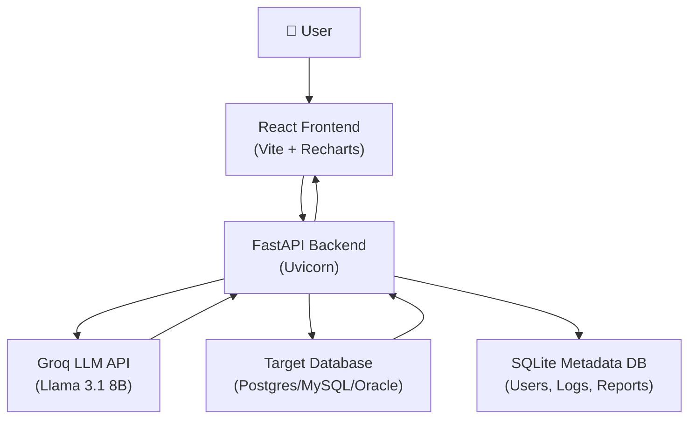

# 🔍 AI Database Assistant — Complete Project Audit Report

**Author:** Madhu Sudhan Suravaram  
**Analyzed:** June 15, 2026  
**Total Files Reviewed:** 55+ source files across backend, frontend, services, routes, tests, and infrastructure

---

## 1. Project Overview

| Attribute | Details |
|---|---|
| **Project Name** | AI Database Assistant |
| **Type** | Full-Stack AI-Powered BI Tool |
| **Backend** | Python 3.12, FastAPI, Groq LLM (Llama 3.1 8B) |
| **Frontend** | React 19 + Vite 8, Recharts |
| **Databases Supported** | PostgreSQL, MySQL, Oracle |
| **Metadata Store** | SQLite (local) |
| **Auth** | JWT (bcrypt + PyJWT) |
| **Deployment** | Docker Compose (backend + nginx frontend) |
| **LLM Provider** | Groq Cloud (llama-3.1-8b-instant) |

### Architecture Diagram



### Feature Inventory (What's Built)

| Feature | Status |
|---|---|
| Natural Language → SQL | ✅ Working |
| Multi-DB support (PG/MySQL/Oracle) | ✅ Working |
| Dynamic schema discovery + FK relationships | ✅ Working |
| AI-powered chart type selection | ✅ Working |
| Auto-generated insights (4 sections) | ✅ Working |
| KPI auto-detection | ✅ Working |
| SQL auto-repair on failure | ✅ Working |
| JWT auth + user registration | ✅ Working |
| User-scoped history, favorites, reports | ✅ Working |
| Admin panel with RBAC | ✅ Working |
| Dashboard with live KPI cards + charts | ✅ Working |
| CSV & Excel export | ✅ Working |
| Plain-English query explanation | ✅ Working |
| SQL injection protection | ✅ Working |
| Docker Compose deployment | ✅ Working |
| Rotating log files | ✅ Working |
| Global exception handler | ✅ Working |

---

## 2. 🐛 Identified Bugs & Errors

### BUG-1: `datetime.utcnow()` is deprecated (Python 3.12+)

> [!WARNING]
> `datetime.utcnow()` is deprecated since Python 3.12 and will be removed in a future version.

**File:** [auth_service.py](file:///c:/Users/LENOVO/OneDrive/Desktop/AI%20-db%20assistant/app/services/auth_service.py#L35-L37)
```python
# Lines 35-37 — uses deprecated utcnow()
expire = datetime.utcnow() + expires_delta
expire = datetime.utcnow() + timedelta(minutes=ACCESS_TOKEN_EXPIRE_MINUTES)
```
**Fix:** Replace with `datetime.now(timezone.utc)` from the `datetime` module.

---

### BUG-2: `COMMENT` in SQL forbidden keywords causes false positives

**File:** [query_validator.py](file:///c:/Users/LENOVO/OneDrive/Desktop/AI%20-db%20assistant/app/services/query_validator.py#L14-L20)

The word `comment` is in `FORBIDDEN_KEYWORDS`. This will block legitimate queries like:
```sql
SELECT comment FROM feedback_table
```
Since `\bcomment\b` matches column names too, this is a false positive risk.

---

### BUG-3: `admin/stats` daily metrics dict-access on non-Row cursor

**File:** [main.py](file:///c:/Users/LENOVO/OneDrive/Desktop/AI%20-db%20assistant/app/main.py#L150-L158)

The admin stats query uses `row_factory = sqlite3.Row` via `get_metadata_connection()`, but the daily metrics loop accesses rows with string keys (`r["query_date"]`). This works because `get_metadata_connection()` sets `conn.row_factory = sqlite3.Row`, but if the connection were to change, it would break silently.

---

### BUG-4: `connection_store.py` is a mutable global dict — not thread-safe

**File:** [connection_store.py](file:///c:/Users/LENOVO/OneDrive/Desktop/AI%20-db%20assistant/app/db/connection_store.py)

```python
active_connection = {
    "db_type": None,
    "host": None,
    ...
}
```

This is a **process-level global**, meaning:
- With multiple Uvicorn workers (`--workers 2+`), each worker gets its own copy — connections won't sync.
- With a single worker using threads, concurrent requests during a connection switch could read partially-updated state.

---

### BUG-5: Schema routes crash with 500 if no database connection

**File:** [schema.py](file:///c:/Users/LENOVO/OneDrive/Desktop/AI%20-db%20assistant/app/routes/schema.py#L30-L60) — `/schema`, `/table-columns`, `/table-data`, `/table-counts`

Error logs confirm this is a recurring 500 error:
```
Exception: No active database connection selected.
```
These routes have no try/except and no connection guard. The crash is caught by the global exception handler, but the user gets an opaque 500 error instead of a helpful message.

---

### BUG-6: Dashboard SQL queries are hardcoded to a property-management schema

**File:** [dashboard.py](file:///c:/Users/LENOVO/OneDrive/Desktop/AI%20-db%20assistant/app/routes/dashboard.py#L56-L91)

The `/dashboard/summary` endpoint runs hardcoded queries like:
```sql
SELECT SUM(amount) FROM payments WHERE LOWER(payment_status) = 'paid'
SELECT COUNT(*) FROM tenants WHERE LOWER(status) = 'active'
```

These will fail for **any database** that doesn't have `payments`, `tenants`, `rooms`, `maintenance_requests`, `expenses`, and `properties` tables.

---

### BUG-7: LLM still generates `TIMESTAMPDIFF()` for PostgreSQL

**Error logs analysis** confirms the LLM repeatedly generates `TIMESTAMPDIFF(YEAR, ...)` and `TIMESTAMPDIFF(MONTH, ...)` for PostgreSQL even though the prompt explicitly says not to. The repair service also fails to fix this because **it passes the same instruction**, and the LLM ignores it again.

---

### BUG-8: `test-connection` endpoint doesn't require auth

**File:** [connection.py](file:///c:/Users/LENOVO/OneDrive/Desktop/AI%20-db%20assistant/app/routes/connection.py#L10-L11)

```python
@router.post("/test-connection")
def test_connection(data: ConnectionRequest):
```

This endpoint accepts arbitrary database credentials and attempts connections **without requiring authentication**. Any unauthenticated user can probe database hosts.

---

### BUG-9: Database credentials stored in plaintext in localStorage

**File:** [ConnectionManager.jsx](file:///c:/Users/LENOVO/OneDrive/Desktop/AI%20-db%20assistant/ai-db-frontend/src/components/ConnectionManager.jsx#L163-L173)

```javascript
localStorage.setItem("activeConnection", JSON.stringify({
    dbType, host, port: getPort(), database, username, password
}));
```

Database passwords are stored in plaintext in the browser's localStorage. This is a security vulnerability — any XSS attack or browser extension can read these credentials.

---

### BUG-10: Frontend hardcodes backend URL to `127.0.0.1:8000`

**Files:** [App.jsx](file:///c:/Users/LENOVO/OneDrive/Desktop/AI%20-db%20assistant/ai-db-frontend/src/App.jsx), [AuthPage.jsx](file:///c:/Users/LENOVO/OneDrive/Desktop/AI%20-db%20assistant/ai-db-frontend/src/components/AuthPage.jsx), [Dashboard.jsx](file:///c:/Users/LENOVO/OneDrive/Desktop/AI%20-db%20assistant/ai-db-frontend/src/components/Dashboard.jsx), [AdminDashboard.jsx](file:///c:/Users/LENOVO/OneDrive/Desktop/AI%20-db%20assistant/ai-db-frontend/src/components/AdminDashboard.jsx)

Backend URL is hardcoded as `http://127.0.0.1:8000` in 20+ places across the frontend. This will break:
- In Docker (the backend is `ai-db-backend:8000` internally)
- In production deployments
- When using `localhost` vs `127.0.0.1`

ConnectionManager.jsx uses `http://localhost:8000` — different from the rest of the app which uses `http://127.0.0.1:8000`.

---

### BUG-11: `EmailStr` imported but not used for validation

**File:** [auth.py](file:///c:/Users/LENOVO/OneDrive/Desktop/AI%20-db%20assistant/app/routes/auth.py#L2)

```python
from pydantic import BaseModel, EmailStr
```

`EmailStr` is imported but the `UserRegister` model uses `email: str` instead of `email: EmailStr`, so email validation is skipped. Users can register with invalid emails.

---

### BUG-12: `generate_sample_data.py` has hardcoded credentials

**File:** [generate_sample_data.py](file:///c:/Users/LENOVO/OneDrive/Desktop/AI%20-db%20assistant/scripts/generate_sample_data.py#L8-L13)

```python
conn = psycopg2.connect(
    host="localhost", port="5432",
    database="ai_db_assistant",
    user="chintakuntasaikiranreddy"  # hardcoded personal credential
)
```

---

### BUG-13: `test_sprint6_ops.py` has incorrect sys.path

**File:** [test_sprint6_ops.py](file:///c:/Users/LENOVO/OneDrive/Desktop/AI%20-db%20assistant/test_sprint6_ops.py#L6)

```python
sys.path.append(os.path.abspath(os.path.join(os.path.dirname(__file__), "..", "..", "..", "..", "..", "OneDrive", "Desktop", "v2", "AI -db assistant")))
```

This path points to `v2/AI -db assistant` which is a different directory. The test will fail outside of the original author's machine.

---

## 3. 🔒 Security Analysis

| Issue | Severity | Details |
|---|---|---|
| **Hardcoded JWT secret in default** | 🔴 HIGH | Default `jwt_secret` is `"ai-database-assistant-super-secret-key-change-in-production"` — deployed as-is it's trivially guessable |
| **No password policy** | 🟡 MEDIUM | Users can register with any password (even `a`). No minimum length, complexity, or breached password check |
| **No rate limiting** | 🟡 MEDIUM | No rate limiting on `/auth/login`, enabling brute-force attacks. No rate limiting on `/ask`, enabling LLM API abuse |
| **DB creds in localStorage** | 🔴 HIGH | Plaintext database credentials stored in browser storage |
| **`/test-connection` unauthenticated** | 🔴 HIGH | Allows probing arbitrary database hosts without login |
| **No HTTPS enforcement** | 🟡 MEDIUM | JWT tokens sent over HTTP in development (also no `Secure` flag on storage) |
| **Admin seed password in `.env.example`** | 🟡 MEDIUM | `ADMIN_PASSWORD=change_me` is weak and may be deployed as-is |
| **Error messages expose internals** | 🟡 MEDIUM | `admin/stats` error: `f"Failed to fetch admin statistics: {str(e)}"` leaks internal error details |
| **SQL in error responses** | 🟡 MEDIUM | Error intelligence returns SQL snippets and column names to the frontend, revealing schema |
| **CORS allows all methods/headers** | 🟡 MEDIUM | `allow_methods=["*"]` and `allow_headers=["*"]` is overly permissive |

---

## 4. 📐 Code Quality Issues

### Architecture Issues

| Issue | Location | Impact |
|---|---|---|
| **Monolithic `main.py` (538 lines)** | [main.py](file:///c:/Users/LENOVO/OneDrive/Desktop/AI%20-db%20assistant/app/main.py) | All endpoint logic (favorites, reports, history, ask) is in one file instead of separate routers |
| **Duplicate code patterns** | `schema/fingerprint`, saved-reports, favorites all repeat the same schema-hash + connection lookup | Violates DRY principle |
| **Missing `__init__.py`** in some packages | `app/routes/`, `app/core/` | May cause import issues in some configurations |
| **No async endpoints** | All routes are synchronous `def` | Blocks the event loop during DB calls and LLM API calls |
| **No dependency injection** for DB connections | Each service manages its own `get_connection()` + `cursor.close()` + `conn.close()` boilerplate | Error-prone resource management |

### Code Smells

| Issue | Location |
|---|---|
| File named `chat_data_service.py` but comment says `chart_data_service.py` | [chat_data_service.py](file:///c:/Users/LENOVO/OneDrive/Desktop/AI%20-db%20assistant/app/services/chat_data_service.py#L1) |
| `re` imported in `main.py` but never used | [main.py L6](file:///c:/Users/LENOVO/OneDrive/Desktop/AI%20-db%20assistant/app/main.py#L6) |
| Multiple Groq client instances (one per service file) | `ai_service.py`, `insight_service.py`, `chart_decision_service.py`, `explanation_service.py`, `sql_repair_service.py` — 5 separate `Groq()` client instantiations |
| `DIALECT_MAP` duplicated in `ai_service.py` and `sql_repair_service.py` | Creates maintenance burden |
| `.DS_Store` files in the repo | macOS artifacts committed to git |
| `package-lock.json` at root (95 bytes, nearly empty) | Misleading, root is not a Node project |
| Two `config.py` files | `app/config.py` (3 lines) and `app/core/config.py` (36 lines) — confusing |
| Unused imports | `React` imported in AuthPage.jsx (not needed in React 17+) |

---

## 5. 📊 Error Log Analysis

From [errors.log](file:///c:/Users/LENOVO/OneDrive/Desktop/AI%20-db%20assistant/logs/errors.log) (777 lines, 43KB):

| Error Pattern | Count | Root Cause |
|---|---|---|
| `No active database connection selected` | 6 occurrences | Schema/table routes called before user connects a database |
| `TIMESTAMPDIFF` on PostgreSQL | 4 occurrences | LLM generates MySQL syntax for PostgreSQL; repair also fails |
| `missing FROM-clause entry for table` | 2 occurrences | LLM generates incorrect SQL with wrong aliases |
| `ORA-00907: missing right parenthesis` | 1 occurrence | Oracle syntax error from LLM |
| `ORA-00933: SQL command not properly ended` | 1 occurrence | Semicolon left in query sent to Oracle |
| `ZeroDivisionError` | 2 occurrences | Test-injected error (expected behavior) |

---

## 6. 📋 README & Documentation Gaps

| Issue | Details |
|---|---|
| **README is outdated** | Lists only basic features from V1.0, doesn't mention auth, admin panel, SQL repair, multi-DB, insights, KPIs, favorites, saved reports |
| **Project structure in README is incomplete** | Missing `core/`, `routes/`, most services, Docker files |
| **API endpoints incomplete** | Only 3 endpoints documented; project has 20+ endpoints |
| **No API docs link for Swagger** | Swagger UI exists at `/docs` but not mentioned prominently |
| **`.env.example` and README disagree on env vars** | README shows `DB_NAME` but actual env uses `DB_NAME` — small but the full variable list differs |
| **No architecture diagram** | Text-based flow in README is hard to understand |
| **Planned V1.1 section is stale** | Features listed as "planned" are already implemented |

---

## 7. 🚀 Future Enhancement Recommendations

### 🟢 Priority 1: Critical Fixes (Do These First)

| # | Enhancement | Effort | Impact |
|---|---|---|---|
| 1 | **Centralize API base URL** — Use an environment variable or Vite `import.meta.env.VITE_API_URL` | Low | Fixes Docker, production, and mixed URL bugs |
| 2 | **Add connection guard to schema routes** — Return 400 with "Please connect a database first" | Low | Eliminates the #1 recurring error |
| 3 | **Require auth for `/test-connection`** — Add `Depends(get_current_user)` | Low | Closes a security hole |
| 4 | **Remove DB credentials from localStorage** — Store only the connection status, not passwords | Low | Critical security fix |
| 5 | **Fix `datetime.utcnow()` deprecation** | Low | Future-proofing for Python 3.13+ |
| 6 | **Use `EmailStr` for email validation** | Low | Prevents garbage email registrations |

---

### 🟡 Priority 2: Important Improvements

| # | Enhancement | Effort | Impact |
|---|---|---|---|
| 7 | **Make the dashboard dynamic** — Instead of hardcoded queries for a PG management schema, use AI to generate dashboard KPIs from whatever database is connected | Medium | Makes the dashboard universally useful |
| 8 | **Add rate limiting** — Use `slowapi` or a Redis-based limiter for login + ask endpoints | Medium | Prevents brute-force and LLM API abuse |
| 9 | **Add password policy** — Minimum 8 chars, at least 1 number, 1 special char | Low | Enterprise security requirement |
| 10 | **Move routes out of `main.py`** — Create `routes/ask.py`, `routes/history.py`, `routes/favorites.py`, `routes/reports.py` | Medium | Clean architecture |
| 11 | **Create a shared Groq client singleton** — Instead of 5 separate `Groq()` instances | Low | Reduces memory and connection overhead |
| 12 | **Add a `/disconnect` endpoint** — Clear the active connection and schema cache | Low | Proper session lifecycle |
| 13 | **Add pagination** — History, favorites, and reports lists will grow unbounded | Medium | Performance at scale |
| 14 | **Refresh token support** — Currently tokens expire in 60 minutes with no renewal | Medium | Better UX, no sudden logouts |

---

### 🔵 Priority 3: Feature Additions

| # | Enhancement | Effort | Impact |
|---|---|---|---|
| 15 | **Natural language follow-up questions** — "Show me the same but for last year" should use conversation context | High | Massive UX improvement |
| 16 | **Query result caching** — Cache identical questions with the same schema hash | Medium | Reduces LLM API costs and latency |
| 17 | **Streaming responses** — Use Server-Sent Events (SSE) so the user sees results appearing progressively | Medium | Feels much faster |
| 18 | **Export dashboard as PDF** — Add a "Download PDF" button for the entire dashboard | Medium | Enterprise reporting |
| 19 | **Multi-model support** — Allow switching between LLM models (GPT-4, Claude, local Ollama) | Medium | Flexibility and cost control |
| 20 | **Voice input** — "Ask your database" via microphone using Web Speech API | Medium | Differentiation feature |
| 21 | **Scheduled reports** — "Email me this chart every Monday" | High | Enterprise value |
| 22 | **Multi-database query** — Join data from two different databases | High | Advanced analytics |
| 23 | **SQL editor mode** — Let power users write/edit SQL directly with syntax highlighting | Medium | Power user feature |
| 24 | **Role-based data access** — Admin can restrict which tables/columns a user can query | High | Enterprise security |
| 25 | **Audit trail export** — Export all query logs as CSV for compliance | Low | Enterprise compliance |
| 26 | **Dark/Light theme toggle in auth page** — Currently the auth page doesn't respect the theme | Low | Polish |
| 27 | **Mobile responsive design** — The sidebar layout doesn't work on mobile | Medium | Broader usability |
| 28 | **Onboarding tutorial** — First-time user walkthrough showing how to connect and ask | Low | Reduces support burden |
| 29 | **Query pinning/comparison** — Pin a query result and compare it side-by-side with another | Medium | Analytics power feature |
| 30 | **Webhook/Slack notifications** — Send alerts when KPIs cross thresholds | High | Enterprise monitoring |

---

## 8. Testing Status

| Test Area | Status | Notes |
|---|---|---|
| `test_sprint6_ops.py` | ⚠️ Has broken `sys.path` | Points to old directory `v2/AI -db assistant` |
| `test_sprint7_admin.py` | ✅ Functional | Tests admin RBAC and telemetry correctly |
| `test_ai.py` | ⚠️ Minimal | Only prints `get_relationships()`, not a real test |
| Unit tests for services | ❌ None | No pytest tests for any service module |
| Frontend tests | ❌ None | No Jest/Vitest tests for React components |
| Integration tests | ❌ None | No end-to-end tests |
| Load testing | ❌ None | No performance benchmarks |

> [!IMPORTANT]
> **Recommendation:** Add at least:
> - Pytest unit tests for `query_validator.py`, `kpi_service.py`, `trend_detection.py`, `history_service.py`
> - Vitest component tests for `ChatArea`, `AuthPage`, `Dashboard`
> - A CI/CD pipeline (GitHub Actions) that runs tests on every PR

---

## 9. Overall Assessment

### Strengths ✅
- **Well-architected modular backend** — Clean separation into services, routes, models, and core
- **Multi-DB support** is genuinely impressive — Postgres, MySQL, and Oracle with dialect-specific SQL generation
- **SQL security validation** is thorough — 6 layers of protection including injection pattern detection
- **Error intelligence system** is a standout feature — Suggests specific columns/tables when queries fail
- **SQL auto-repair** is innovative — Catches errors and attempts LLM-based recovery
- **Clean, comprehensive logging** — Three rotating log files with proper separation
- **Professional admin telemetry** — RBAC-restricted dashboard with daily metrics

### Areas for Improvement ⚠️
- **Security hardening** needed (rate limiting, password policy, credential storage)
- **Frontend needs API URL centralization** — Currently breaks in any non-localhost environment
- **Dashboard is domain-specific** — Only works with the PG management schema
- **No test coverage** beyond 2 manual test scripts
- **README needs major update** — Doesn't reflect the actual feature set
- **Code duplication** — Schema hash lookups, Groq client instantiation, connection boilerplate

### Grade: **B+**
This is a solid, feature-rich portfolio project that demonstrates strong full-stack skills. The architecture is clean, the feature depth is impressive, and the error-handling is thoughtful. With the security fixes and test coverage added, this would be production-ready.

---

> [!TIP]
> **Quick wins to boost this project:**
> 1. Fix the 6 Priority 1 items (1-2 hours total)
> 2. Update the README with all features, screenshots, and the full API list
> 3. Add 10 pytest unit tests for the service modules
> 4. Make the dashboard schema-agnostic
> 5. Centralize the frontend API URL with a Vite env variable
